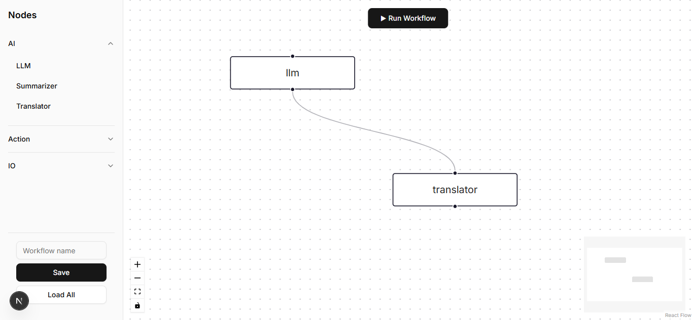

# ⚡ OrchestrAI – AI Workflow Builder(v0.9)

> **No-code, drag-and-drop AI pipeline builder** with real-time collaboration, powered by **Next.js 15**, **React Flow**, **Postgres**, **Redis**, and **OpenAI**.

---

## 📸 Preview

<p align="center">
  
</p>


---

## 🎯 What is OrchestrAI?

OrchestrAI is a **visual AI workflow builder** that lets you design, execute, and share AI-powered pipelines **without writing code**.  
Think of it as a **Figma for AI workflows** – connect nodes like **LLM, Summarizer, Translator, Web Scraper, Emailer, CSV Writer**, and watch the magic happen.

Built for **developers, data analysts, and AI enthusiasts** who want **full control** over their AI automations.

---

## 🧩 Current Features (v0.9)

| Feature Area       | Description |
|--------------------|-------------|
| **Canvas**         | Blank React Flow canvas with drag-drop AI and utility nodes. |
| **Node Palette**   | JSON-driven sidebar (`src/config/nodes.json`) – add new nodes by editing a single file. |
| **Node Config**    | Double-click a node → edit prompts/settings in a shadcn Sheet. |
| **Run Workflow**   | ▶ **Run** executes the flow via `/api/run`, returns AI results. |
| **Delete Node**    | Dedicated delete button inside each config sheet. |
| **Real-time Sync** | Y.js + Socket.IO – multi-tab/collaborative editing. |
| **Backend**        | Express + Prisma + Postgres (Supabase) + Redis + WebSocket. |
| **Frontend**       | Next.js 15 + React Flow 11 + Tailwind v4 + shadcn/ui + Sonner. |

---

## 🛠️ Tech Stack

- **Frontend**: Next.js 15, React Flow 11, Tailwind CSS v4, shadcn/ui, Sonner  
- **Backend**: Node.js 22, Express, Prisma, Postgres (Supabase), Redis, Socket.IO  
- **AI**: OpenAI API, LangChain  
- **Collaboration**: Y.js + Socket.IO  
- **Dev Tools**: TypeScript, tsx, dotenv  

---

## 🚀 Quick Start (Local)

### Backend
```bash
cd apps/api
pnpm install
pnpm dev  # Runs API & WebSocket on localhost:4000

---

### Frontend
```bash
cd apps/web
pnpm install
pnpm dev  # Runs UI on localhost:3000

---

### 🔐 Environment Variables (example template)
DATABASE_URL=postgresql://<user>:<password>@...:5432/postgres
REDIS_URL=<your-remote-redis-endpoint>
OPENAI_API_KEY=sk-xxxxxxx
PORT=4000  # optional, platform usually injects its own

